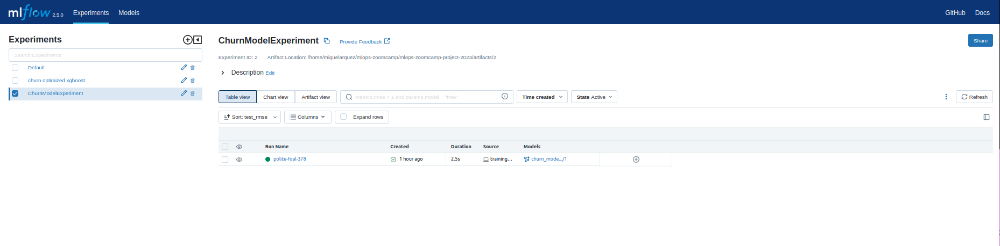

# MLOps zoomcamp Project - Cohort 2023


# 1. Problem description

The **ABC Multistate bank**  has churn problem, also known as a customer churn problem, is a machine learning problem focused on predicting whether a customer is likely to leave (churn) or stay with a bank based on historical data. Churn refers to the process by which customers discontinue their relationship with a company or service, and in the context of a bank, it means customers closing their accounts and moving to another bank.

* Problem type: Supervised/Classification


## Dataset

 The dataset was found as a [Kaggle dataset](https://www.kaggle.com/datasets/gauravtopre/bank-customer-churn-dataset). Sample data:
| customer_id | credit_score | country | gender | age | tenure | balance | products_number | credit_card | active_member | estimated_salary | churn |
|-------------|--------------|---------|--------|-----|--------|---------|-----------------|-------------|---------------|------------------|-------|
| 15634602    | 619          | France  | Female | 42  | 2      | 0       | 1               | 1           | 1             | 101348.88        | 1     |
| 15647311    | 608          | Spain   | Female | 41  | 1      | 83807.86| 1               | 0           | 1             | 112542.58        | 0     |
| 15619304    | 502          | France  | Female | 42  | 8      | 159660.8| 3               | 1           | 0             | 113931.57        | 1     |
| 15701354    | 699          | France  | Female | 39  | 1      | 0       | 2               | 0           | 0             | 93826.63         | 0     |
| 15737888    | 850          | Spain   | Female | 43  | 2      | 125510.82| 1               | 1           | 1             | 79084.1          | 0     |


## Proposed Solution

As a machine learning problem, the goal is to build a predictive model that can accurately identify customers who are at risk of churning. This model can help banks take proactive measures to retain valuable customers by offering targeted incentives, personalized services, or early intervention strategies.

* Solution type: **batch deployment** for the model tranining and inference.

# 2. Cloud

The tech stack used:

The project uses:

1. [Pipenv](https://docs.pipenv.org/)
2. [docker](docker.com)
3. [mlflow]()
4. [grafana]()
5. [prefect]()

We use Makefile to reproduce the needed environment in any infrastructure.

```bash
SHELL=/bin/bash

build-environment-and-services:
	@echo "Building Python environment"
	pip install pipenv &&\
	pipenv install
	@echo "Running MLFlow Server on localhost:5000"
	rm -rf mlflow.db mlruns/ &&\
	nohup mlflow server \
		--backend-store-uri sqlite:///mlflow.db \
		--default-artifact-root ./artifacts \
		--host localhost:5000 &
		
	@echo "Deploying Prefect Server on localhost:4200"
	nohup prefect server start &
	@echo "Deploying Monitoring Service"
	docker-compose  -f monitoring/docker-compose.yml up -d
	@echo "Deploying Grafana on localhost:3000"
	@echo "Deploying Adminer on localhost:8080"
	@echo "The local environment is ready to be used."
```

Execute entire environment:

```bash
make
```

# 3. Experiment Tracking and model registry

For experiment tracking and model registry we use `mlflow`



2. Register model


3. Promote best model to Production


# 4. Workflow orchestration

We use prefect for orchestration in:


1. Model training

2. Model inference (Predict new data)

3. Model monitoring (Calculate drift, and model performance)


# 5. Model Deployment

Deployment is done via `Makefile` + `Dockerfile`


# 6. Model monitoring


# Reproducibility

1. Run `Makefile`
2. Execute
